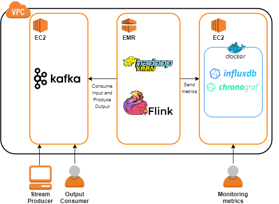

### **NYC Schoolbus Breakdown Analysis with Apache Flink**
This is a repository for an academic project analyzing a datastream about NYC Schoolbus breakdowns.
The datastream is processed using Apache Flink in order to answer some queries about the counties and the time slots in which breakdowns occurred and the companies involved in the outage events.
The complete datastream is available at: http://www.ce.uniroma2.it/courses/sabd1920/projects/prj2_dataset.zip .

The query answered are the following:
1. Calculate the schoolbus average delay by counties in the last 24 hours, 7 days and 30 days
2. Calculate the top 3 most frequent outage causes in the two time slot of service: 5:00-11.59 and 12:00-19:00. The rank has to be calculated in the last 24 hours and 7 days.
3. Calculate the top 5 companies with the highest outage score. The rank has to be calculated in the last 24 hours and 7 days.
 
#### Architecture Overview 
 

The datastream is processed on an EMR cluster using Apache Flink and Hadoop YARN as resource manager. Flink consumes the input record from a Kafka topic and inserts the output records into another Kafka topic. The Kafka server is executed on a EC2 instance. The records are producted from an external system (StreamSimulator). During the execution, Flink collects some performance metrics and sends them to another EC2 instance. A docker network including InfluxDB and Chronograf is deployed on this instance in order to offer a graphic visualization of the collected metrics.

#### Deployment Guide

* Launch an EMR cluster with Flink, Hadoop and Zookeeper installed
* Launch two EC2 instances with at least 4O GB of hard storage (for Docker requirements)
  in the same VPC of the EMR cluster
* Allow the inbound traffic to EC2 security group from the system where StreamSimulator is executed, the systems used to monitor the performance metrics, the system used to access the output and from  both master and slave EMR security groups
* Allow the inbound traffic to both master and slave EMR security groups from the system used to submit the Flink job to the cluster
* In the EMR cluster copy `/opt/flink-metrics-influxdb-1.10.0.jar` into the `/lib` folder of Flink distribution
* In the EMR cluster modify the Flink's configuration file to collect metrics into InfluxDB (specifying at least `metrics.reporter.influxdb.class`, `metrics.reporter.influxdb.host`, `metrics.reporter.influxdb.port` and `metrics.reporter.influxdb.db`)
* In the EMR cluster set the `HADOOP_CONF_DIR` and `HADOOP_CLASSPATH` environment variables
* In the EMR cluster launch `./bin/yarn-session.sh -tm 4096 -s 4` in order to execute a yarn session in which each task manager has 4GB to mantain the Flink's heap and 4 task slots
* Move the scripts contained in the `Monitoring` directory of this repository to an EC2 instance
* Execute `Monitoring/docker-setup.sh` to install docker
* Execute `Monitoring/launch_ic_stack.sh` to launch a docker network with two container with InfluxDB and Chronograf respectively
* Connect to the port 8888 of this instance to access to Chronograf web UI and create a database with the same name specified in Flink's configuration file
* Move the scripts contained in the directory `Ingestion-Export` of this repository to the other EC2 instance
* Execute `Ingestion-Export/kafka-ec2-installation.sh` to install and execute Kafka (follow the printed instructions in case of errors)
* Execute `Ingestion-Export/create_kafka_topics.sh` to create the Kafka topic used to mantain the input and the output records
* Move the jar of the application to EMR master and run it whit `flink run` specifying the required input parameters
* Now you can execute `Ingestion-Export/create_csv_output_file.sh` on Kafka server to collect in output files the resulting records and you can monitor performance metrics through the Chronograf web UI
